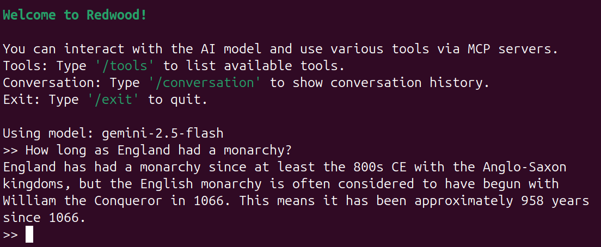

# Redwood

Redwood is a Python project that implements a CLI client for Gemini.

There's also an MCP server with basic tools to help with tasks such as telling the time, running local commands and storing data.

## Motivation

As AI tools get more advanced, they tend to hide away more of the configuration.  Great for end users, but a little annoying if you
want more control.

This tool is pretty raw. It gives full control of the prompt in the one configuration file and makes no assumptions about what
tools to offer the model; leaving it entirely up to the user.

If that's not enough, it's written in Python, and is super simple to modify, should you want to.

<p align="center">
  
</p>

## Quick Start for the CLI app

1. Install uv (`brew install uv`)

2. Run the CLI:

   ```bash
   uvx --from git+https://github.com/douglas-gibbons/redwood cli
   ```

The first time you run it, it will create a configuration file at `~/.config/redwood.yaml` . Edit this file to add your [Gemini API key](https://ai.google.dev/gemini-api/docs/api-key), configure MCP servers, and maybe tweak the prompt for your needs.


## Development

### Requirements

This python app requires:

- uv (`brew install uv`)
- make (`brew install make`)

Check out the code somewhere with:

`git clone https://github.com/douglas-gibbons/redwood.git`

or

`git clone git@github.com:douglas-gibbons/redwood.git`


### Running the CLI

Run this command on a terminal from where you have the code checked out:

```bash
make cli
```

### Running the MCP server

Run `make server` to start the MCP server.


### Testing with inspector

Run

```
npx @modelcontextprotocol/inspector make server
```

# Contributing

Contributions are welcome!

## Reporting Issues

If you find a bug or have a feature request, please open an issue in the repository. Provide as much detail as possible to help us understand and resolve the issue.

## Pull Requests

Please follow these steps to contribute code:

1.  Fork the repository
2.  Create a feature branch (`git checkout -b feature/amazing-feature`)
3.  Commit your changes (`git commit -m 'Add some amazing feature'`)
4.  Run the tests to ensure everything is working:

    ```bash
    make test
    ```

5.  Push to the branch (`git push origin feature/amazing-feature`)
6.  Open a Pull Request

