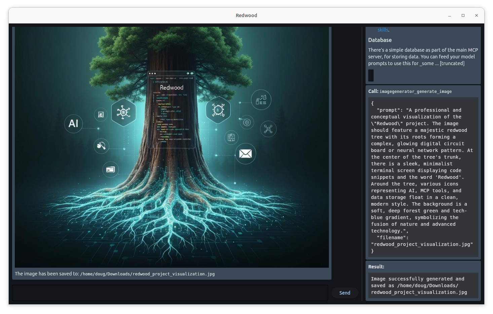
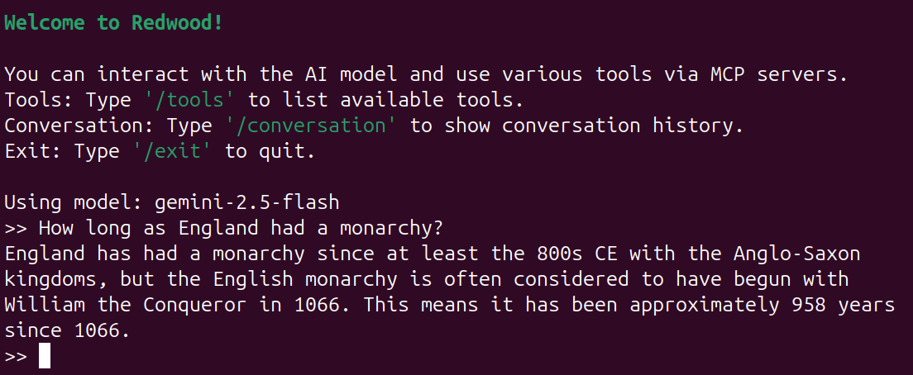

# 🌲 Redwood

**Redwood** is a powerful, highly-configurable CLI and GUI client for Google's Gemini models, built with a focus on transparency and user control. It integrates deeply with the [Model Context Protocol (MCP)](https://modelcontextprotocol.io/) to extend its capabilities with custom tools and data sources.

---

## ✨ Features

- 🖥️ **Dual Interface**: Choice between a sleek [Flet](https://flet.dev/) GUI and a traditional terminal CLI.

<p align="center">
  
  <br>
  <em>The Redwood GUI</em>
</p>

<p align="center">
  
  <br>
  <em>The Redwood CLI</em>
</p>

- 🛠️ **MCP Native**: Seamlessly use MCP tools for tasks like web scraping, file management, and more.
- 🎨 **Image Generation**: Built-in support for image generation models via MCP.
- 🧠 **Full Prompt Control**: Complete control over the system prompt via a single configuration file.
- 📝 **Skills Integration**: Ability to read and utilize specialized [agent skills](https://agentskills.io/).
- 🗄️ **Persistent Storage**: Integrated database for storing user-defined data and lists.

---

## 🚀 Quick Start

### 1. Prerequisites
Ensure you have `uv` installed:
```bash
brew install uv
```

### 2. Launching Redwood
You can run Redwood directly without cloning the repository:

**Run the GUI:**
```bash
uvx --from git+https://github.com/douglas-gibbons/redwood gui
```

**...or run the CLI:**
```bash
uvx --from git+https://github.com/douglas-gibbons/redwood cli
```

### 3. Configuration
On the first run, Redwood creates a configuration file at `~/.config/redwood/redwood.yaml`. 

To get started:
1. Obtain a [Gemini API Key](https://ai.google.dev/gemini-api/docs/api-key).
2. Open `~/.config/redwood/redwood.yaml` and add your key:
   ```yaml
   model:
     name: gemini-2.0-flash-exp
     api_key: YOUR_API_KEY_HERE
   ```
3. Configure your preferred MCP servers and customize the system prompt.

---

## 🛠️ Included Tools

Redwood comes bundled with several core MCP capabilities:

*   **Image Generation**: Saves generated images to a local directory for easy access.
*   **Agent**: A sub-agent tool allowing for parallel task management.
*   **General Utilities**:
    *   **Time**: Provides current date and time context.
    *   **Shell**: Securely run local commands.
    *   **Web Scraper**: Extract content from the web.
    *   **Skills Reader**: Loads markdown-based skills for specific workflows.
*   **Database**: A simple key-value store. You can prompt the model to use this for persistent lists (e.g., "Add milk to my shopping list").

---

## 💡 Pro Tips

### Set Working Directory
The model doesn't automatically know your current directory. Use the `/location` command in the CLI to set your working directory. This injects the current path into the prompt, enabling relative file operations.

### Visualizing Tools
The GUI features a dedicated pane to monitor MCP tool interactions in real-time, providing transparency into the agent's thought process.

---

## 🛠️ Development

### Requirements
- Python with `uv` (`brew install uv`)
- `make` (`brew install make`)

### Local Setup
```bash
git clone https://github.com/douglas-gibbons/redwood.git
cd redwood
```

### Useful Commands
- **Run CLI**: `make cli`
- **Run Server**: `make server`
- **Run Tests**: `make test`
- **Inspect MCP**: `npx @modelcontextprotocol/inspector make server`

---

## 🤝 Contributing

Contributions are welcome! Please feel free to submit a Pull Request or open an issue.

1. Fork the repository.
2. Create your feature branch (`git checkout -b feature/amazing-feature`).
3. Commit your changes (`git commit -m 'Add some amazing feature'`).
4. Open a Pull Request.

---
*Created by Douglas Gibbons*

---
*Disclaimer: This is not an official Google project. It is an open-source project maintained by Douglas Gibbons.*
